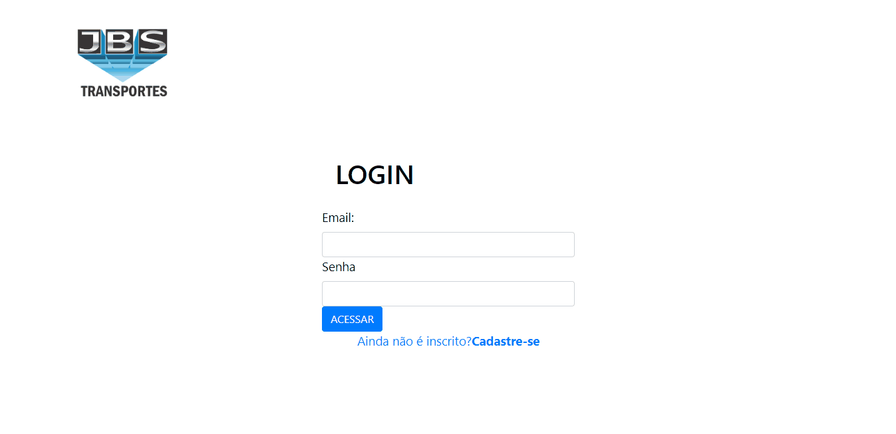

# Cadastro de usuário e Login com PHP

Trabalho realizado com PHP, HTML e CSS junto com Banco de dados MySQL para cadastrar um novo usuário e login ao usuário cadastrado criando uma nova sessão.

# Veja como funciona o sistema

# Código SQL para criar o projeto

    create DATABASE login;
    use login;

    create TABLE usuario (
	  id int AUTO_INCREMENT PRIMARY key,
    nome varchar(30),
    telefone varchar(30),
    email varchar (40),
    senha varchar (32)   
    );

# Sequência com o sistema

Uma opção se deseja implementar seu sistema e precisa de login, a senha utiliza Criptografia MD5 para salvar no banco e para realizar o login, ou seja, a senha do usuário não é salva em texto limpo no banco. Existem também algumas validações para o formulário. Estou postando como parte de um projeto maior que estou desenvolvendo, dessa forma é mais viavel para compreensão e utilização.

Fique a vontade nos commits

